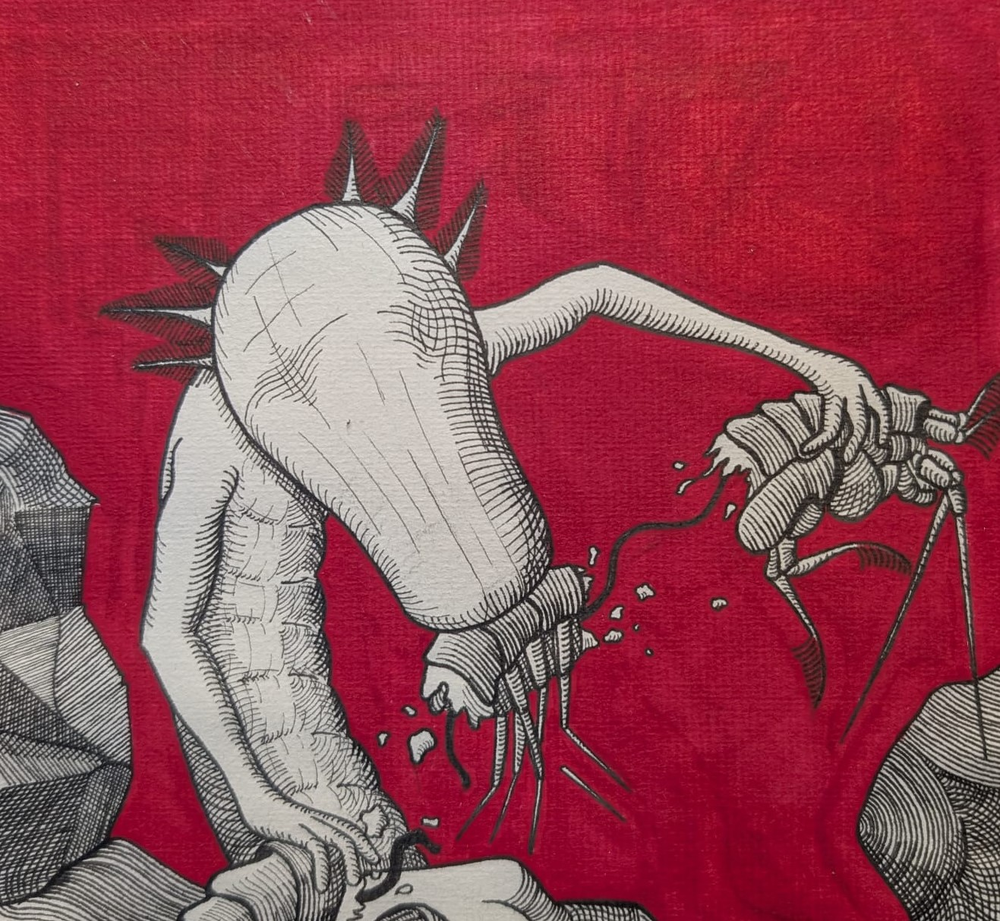

# Masterthesis

## Hybrid Transcriptome Assembly: Review, Benchmark and Application to the Transcriptome of the Cave Salamander

Includes:
- Thesis document
- Corresponding LaTeX project with settings.json-file for compilation with VS Code LaTeX workshop
- Supplementary data (Additional figures, data tables, jupyter-notebooks, ... )
- Defense presentation

  

(Own drawing)
